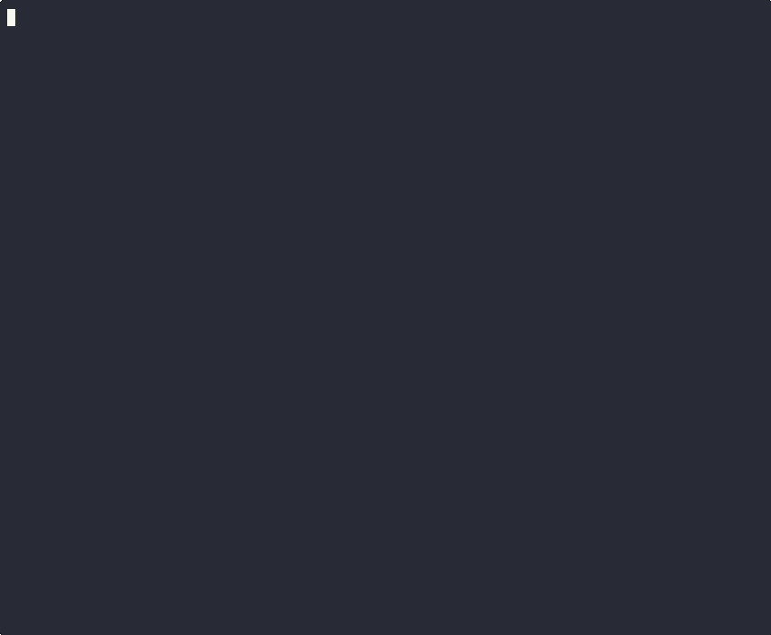
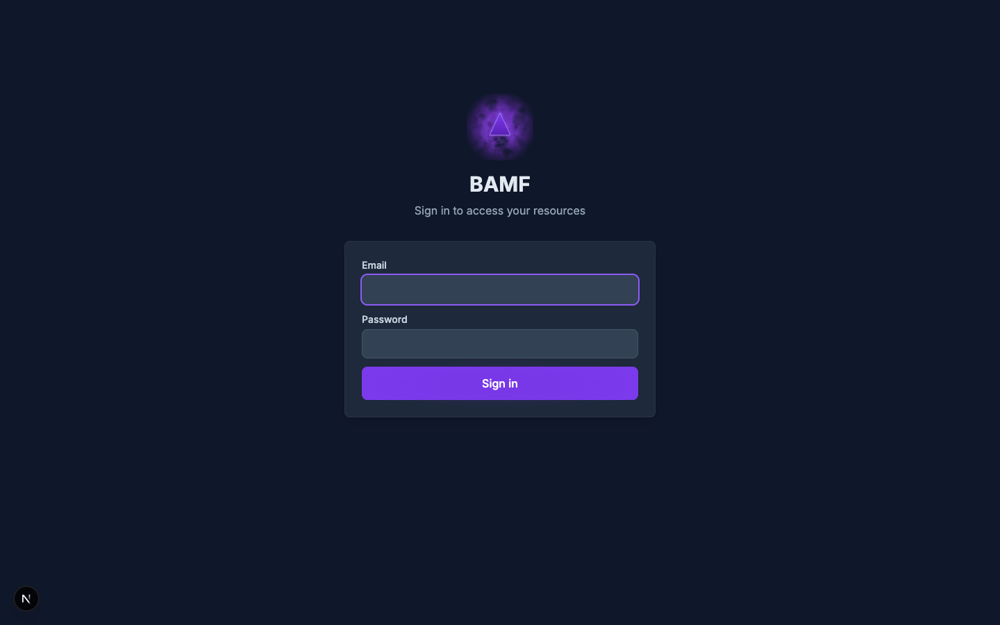
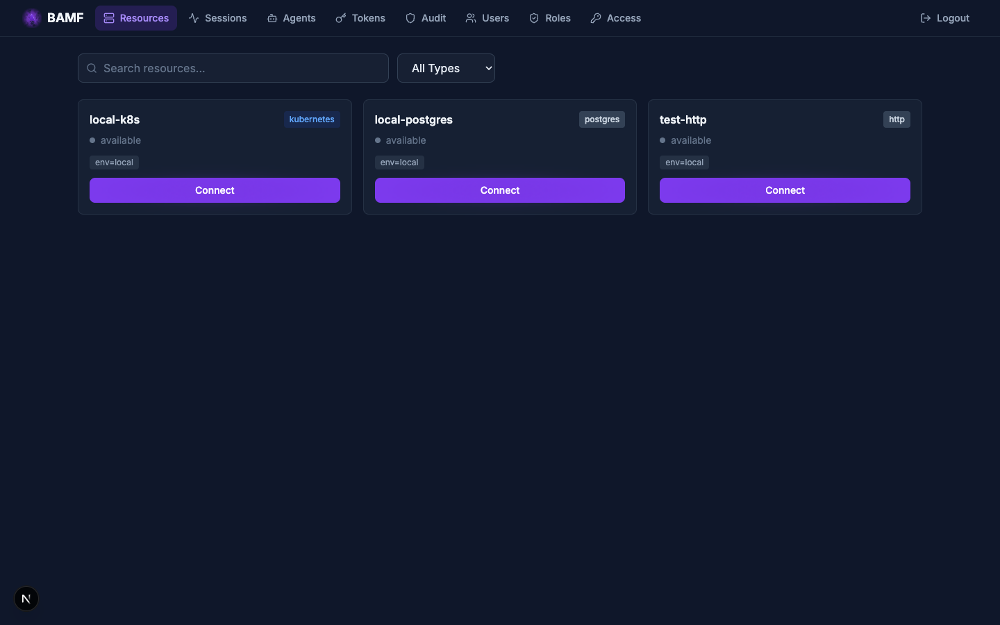
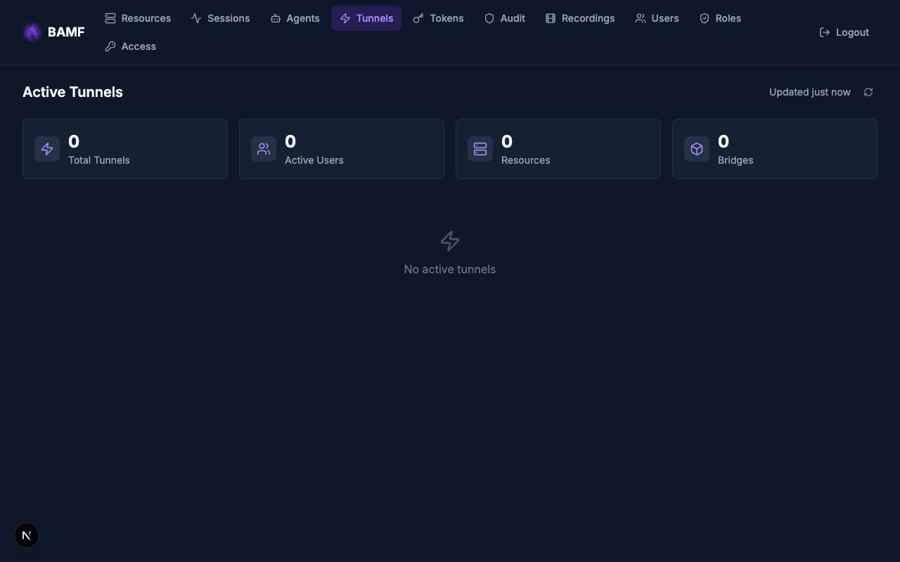
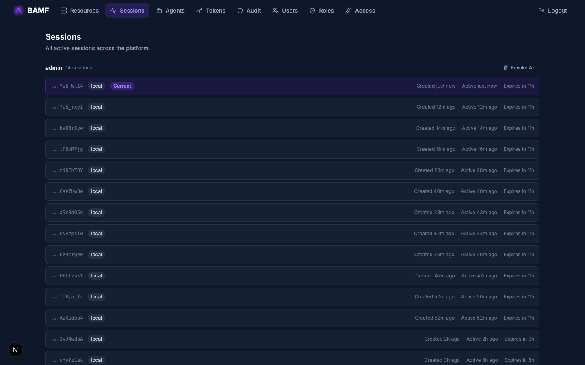
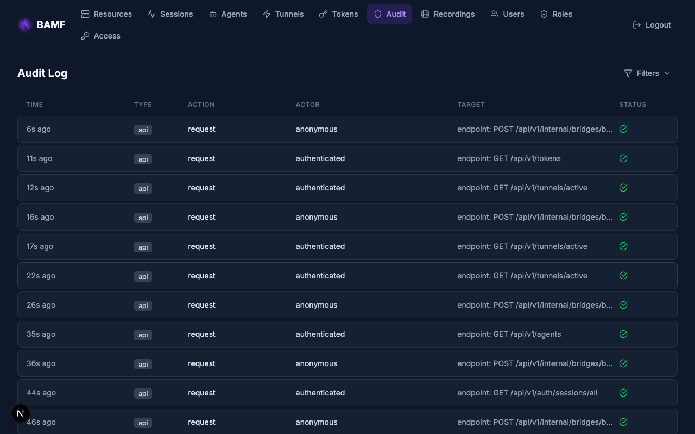
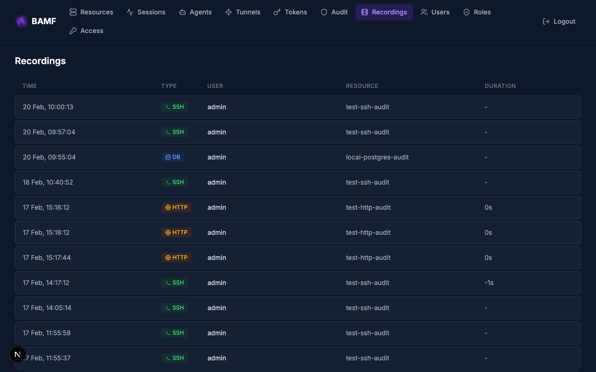
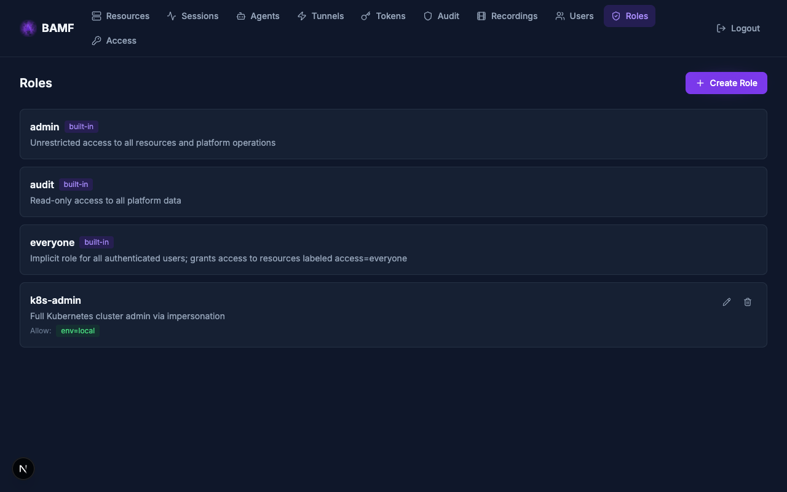
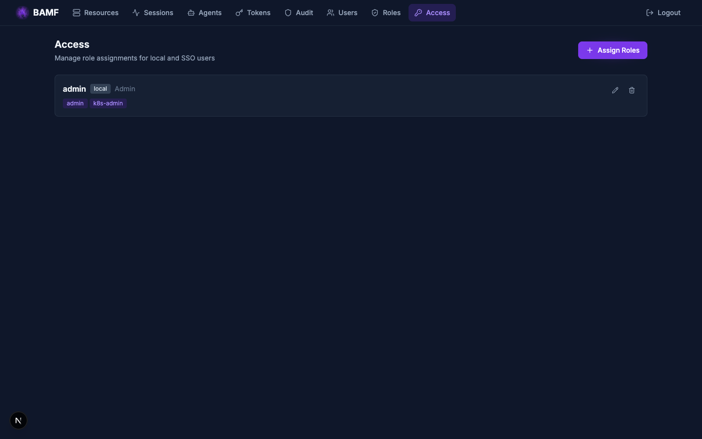

# BAMF — Bridge Access Management Fabric

[](https://github.com/mattrobinsonsre/bamf/actions/workflows/ci.yml)
[](LICENSE)

Secure infrastructure access with short-lived certificates, centralized audit,
and zero-trust tunnels. An open-source alternative to Teleport that builds in
minutes with standard toolchains.

BAMF gives your team secure, audited access to SSH servers, databases, Kubernetes
clusters, and internal web applications — all through a single platform with SSO
integration, role-based access control, and session recording.



## Why BAMF?

Teleport's Community Edition [switched to a commercial license](https://github.com/gravitational/teleport/discussions/39158)
starting with v16 (June 2024). Companies with >100 employees or >$10M revenue
cannot legally use it. And even within those limits, SSO is locked to GitHub
only — Okta, Azure AD, Google, SAML, and generic OIDC all require Enterprise.

BAMF is **GPLv3** — no usage restrictions, no feature gating:

| | BAMF (GPLv3) | Teleport Community |
|---|---|---|
| **SSO (OIDC/SAML)** | All providers included | GitHub only (Okta, Azure AD, SAML: Enterprise) |
| **Session recording** | SSH + DB query + HTTP audit | SSH only (enhanced recording: Enterprise) |
| **Web app access** | Included | Enterprise only |
| **Commercial use** | Unrestricted | <100 employees **and** <$10M revenue |
| **Build from source** | Go + Python, minutes | Go + Rust + C + libfido2, hours |
| **License** | GPLv3 | Commercial (since v16, June 2024) |

[Detailed comparison](docs/comparison.md)

## Features

- **SSO integration** with Auth0, Okta, Google, Azure AD, Keycloak (OIDC), and
  any SAML 2.0 identity provider. MFA is delegated to the IdP — no TOTP or
  WebAuthn implementation to maintain. [Configuration](docs/admin/sso.md)

- **SSH access** with short-lived certificates — no static keys, no TOFU prompts.
  Wraps native `ssh`/`scp`/`sftp` so all flags and config work unchanged.
  [Guide](docs/guides/ssh.md)

- **TCP tunnels** for any TCP service — databases, Redis, message brokers,
  custom protocols. Convenience aliases for `bamf psql` and `bamf mysql`;
  `bamf tcp --exec` for everything else. [Guide](docs/guides/databases.md)

- **Kubernetes access** via standard `kubectl` with a kubeconfig entry pointing
  at BAMF. Uses Kubernetes impersonation — works with Helm, k9s, Lens, Terraform.
  [Guide](docs/guides/kubernetes.md)

- **HTTP proxy** for internal web apps and APIs — browser-based (Grafana,
  Jenkins, ArgoCD) and non-browser (curl, scripts, CI/CD). Per-request auth,
  RBAC, header rewriting, and audit logging. [Guide](docs/guides/web-apps.md)

- **Role-based access control** with allow/deny rules, resource labels, and
  claims-to-roles mapping from identity providers.
  [RBAC guide](docs/admin/rbac.md)

- **Audit logging** of all authentication, authorization, and session events.
  Structured JSON audit log with cursor-based pagination, exportable via REST
  API for SIEM integration.

- **Browser-based terminal** — SSH, PostgreSQL, and MySQL access directly from the
  web UI using xterm.js. Upload your SSH key per-session (never stored) or enter
  database credentials. Sessions survive API pod restarts transparently. No CLI
  installation required. [Guide](docs/guides/web-terminal.md)

- **Session recording** — SSH terminal recording in asciicast v2 format (opt-in
  `ssh-audit` type) with web-based playback. Database query audit logging for
  PostgreSQL and MySQL via passive wire protocol tapping (`postgres-audit`,
  `mysql-audit` types). HTTP request/response audit for web app proxy traffic
  (`http-audit` type) with full exchange capture.

- **Reliable tunnel streams** — TCP tunnels survive bridge pod failure
  transparently. End-to-end reliable framing between CLI and agent retransmits
  unacknowledged data through a new bridge. Application sessions (SSH, psql)
  experience a brief stall, not a disconnect. Graceful bridge drain migrates
  tunnels with zero data loss during scale-in, maintenance, and spot
  termination.

- **Certificate-based trust model** — BAMF CA issues short-lived x509 and SSH
  certificates. No long-lived secrets. Session certs encode the authorization
  decision directly — the bridge validates certs locally during tunnel operation.

- **Real-time operations dashboard** — live tunnel monitoring, agent fleet
  status, session management, resource discovery, audit log viewer, and
  recording playback — all in a modern web UI with auto-refreshing data.

### Web UI

| | |
|---|---|
|  |  |
| Login (local + SSO providers) | Resource discovery with one-click terminal access |
|  |  |
| Live tunnel monitoring | Session management with configurable TTL |
|  |  |
| Structured audit log with filters | SSH, database, and HTTP session recordings |
|  |  |
| RBAC role definitions | Per-user role assignments (local + SSO) |

## Architecture

```
                         Public Internet
                                │
               ┌────────────────┴────────────────┐
               │                                 │
               ▼                                 ▼
    ┌──────────────────────────────────────────────────────┐
    │         Traefik / Istio Gateway (single LB)          │
    │   HTTP routes (API, Web UI, proxy) │ TCP/SNI routes  │
    └──────────┬────────────────────────┴────────┬─────────┘
               │                                 │
               ▼                                 ▼
      ┌──────────────────┐              ┌──────────────────┐
      │   API Server     │              │  Bridge (Go)     │
      │  Python/FastAPI  │◀────────────▶│  StatefulSet     │
      │  CA · RBAC · SSO │              │  tunnel relay    │
      │  HTTP proxy      │              └────────┬─────────┘
      └──────────────────┘                       │
               │                        ┌────────▼─────────┐
      ┌────────▼─────────┐              │   Agents (Go)    │
      │   Web UI (SPA)   │              │   K8s or VM      │
      │   Next.js/React  │              └────────┬─────────┘
      └──────────────────┘                       │
                                         Target Resources
┌──────────────┐                      (servers, databases,
│  CLI (Go)    │                       web apps, K8s clusters)
│  `bamf`      │
└──────┬───────┘
       ├── SSO login ──────▶ API
       └── tunnels ────────▶ Bridge (mTLS)
```

**Go** handles the data path (CLI, bridge, agent) — portable static binaries
with no CGo. **Python** handles the control plane (API, CA, RBAC, SSO, proxy)
where development velocity matters. **Next.js** provides the web UI.

### Kubernetes Ingress Requirements

BAMF requires **SNI-based TLS passthrough** for routing TCP tunnel traffic to
individual bridge pods. This is an advanced ingress capability that goes beyond
standard Kubernetes Ingress resources. BAMF supports two providers:

- **Traefik v3** (default) — uses IngressRouteTCP with `tls.passthrough: true`
  and `HostSNI()` matching. Ships with k3s and Rancher Desktop.
- **Istio Gateway API** — uses TLSRoute (experimental channel) with SNI-based
  passthrough. Requires `istioctl` and Gateway API CRDs.

Standard Kubernetes Ingress objects only support HTTP(S) routing. They cannot
route raw TCP by SNI hostname, which is essential for BAMF's tunnel
architecture. **BAMF must run on a Kubernetes cluster with one of the above
ingress controllers.** It cannot be hosted behind a basic Ingress controller,
a standalone reverse proxy (nginx, HAProxy), or outside Kubernetes without
significant custom infrastructure.

## Quick Start

### Install the CLI

Download the latest release for your platform:

```zsh
# macOS (Apple Silicon)
curl -L https://github.com/mattrobinsonsre/bamf/releases/latest/download/bamf-darwin-arm64 \
  -o /usr/local/bin/bamf && chmod +x /usr/local/bin/bamf

# macOS (Intel)
curl -L https://github.com/mattrobinsonsre/bamf/releases/latest/download/bamf-darwin-amd64 \
  -o /usr/local/bin/bamf && chmod +x /usr/local/bin/bamf

# Linux (amd64)
curl -L https://github.com/mattrobinsonsre/bamf/releases/latest/download/bamf-linux-amd64 \
  -o /usr/local/bin/bamf && chmod +x /usr/local/bin/bamf
```

### Deploy the Platform

```zsh
helm install bamf oci://ghcr.io/mattrobinsonsre/bamf \
  --namespace bamf --create-namespace \
  --set gateway.hostname=bamf.example.com \
  --set gateway.tunnelDomain=tunnel.bamf.example.com \
  --set postgresql.bundled.enabled=true \
  --set redis.bundled.enabled=true \
  --set bootstrap.adminEmail=admin \
  --set bootstrap.adminPassword=changeme
```

See [Deployment Guide](docs/admin/deployment.md) for production configuration.

### Deploy an Agent

```zsh
# Create a join token
bamf tokens create --name prod-agents --ttl 24h

# Deploy the agent (Kubernetes)
helm install bamf-agent oci://ghcr.io/mattrobinsonsre/bamf \
  --set agent.enabled=true \
  --set agent.platformUrl=https://bamf.example.com \
  --set agent.joinToken=${TOKEN}

# Or deploy on a VM
curl -L https://github.com/mattrobinsonsre/bamf/releases/latest/download/bamf-agent-linux-amd64 \
  -o /usr/local/bin/bamf-agent && chmod +x /usr/local/bin/bamf-agent
bamf-agent --platform-url https://bamf.example.com --join-token ${TOKEN}
```

See [Agent Guide](docs/guides/agents.md) for configuration and resource setup.

### Connect

```zsh
# Login
bamf login --api https://bamf.example.com

# SSH
bamf ssh user@web-server

# Database
bamf psql orders-db -U admin -d mydb

# Kubernetes
bamf kube login prod-cluster
kubectl --context bamf-prod-cluster get pods

# Web apps — just open in browser
# https://grafana.tunnel.bamf.example.com
```

## Documentation

| Guide | Description |
|-------|-------------|
| [Getting Started](docs/getting-started.md) | 10-minute first deployment |
| **Access Guides** | |
| [SSH](docs/guides/ssh.md) | SSH, SCP, SFTP |
| [TCP Tunnels](docs/guides/databases.md) | Databases, Redis, HTTP APIs, any TCP |
| [Kubernetes](docs/guides/kubernetes.md) | kubectl through BAMF |
| [HTTP Apps](docs/guides/web-apps.md) | Web apps and HTTP APIs (browser + CLI) |
| [Web Terminal](docs/guides/web-terminal.md) | Browser-based SSH and database access |
| [Agents](docs/guides/agents.md) | Deploying and managing agents |
| **Administration** | |
| [Deployment](docs/admin/deployment.md) | Production Helm deployment |
| [RBAC](docs/admin/rbac.md) | Roles, rules, labels |
| [SSO](docs/admin/sso.md) | OIDC and SAML configuration |
| [Users](docs/admin/users.md) | User and session management |
| [Certificates](docs/admin/certificates.md) | CA management, cert lifecycle |
| **Operations** | |
| [Backup & Restore](docs/operations/backup-restore.md) | PostgreSQL backup, DR |
| [Scaling](docs/operations/scaling.md) | HPA, bridge scaling |
| [Monitoring](docs/operations/monitoring.md) | Prometheus, structured logging |
| [Upgrading](docs/operations/upgrading.md) | Helm upgrade procedures |
| **Architecture** | |
| [Overview](docs/architecture/overview.md) | System design |
| [Tunnels](docs/architecture/tunnels.md) | Tunnel protocol, reliable streams |
| [Authentication](docs/architecture/authentication.md) | Auth flows, connectors, sessions |
| [Security](docs/architecture/security.md) | Certificate model, trust bootstrap |
| **Reference** | |
| [CLI](docs/reference/cli.md) | Complete CLI reference |
| [API](docs/reference/api.md) | REST API endpoints |
| [Helm Values](docs/reference/helm-values.md) | All Helm values documented |
| [Agent Config](docs/reference/agent-config.md) | Agent YAML config reference |
| [Development](docs/development.md) | Building from source |
| [BAMF vs Teleport](docs/comparison.md) | Feature and license comparison |

## Building from Source

```zsh
# Prerequisites: Docker, gmake (brew install make)

# Cross-compile Go binaries for all platforms (runs in Docker)
gmake build

# Build Docker images
gmake images

# Run tests (Go + Python, runs in Docker)
gmake test

# Run linters (runs in Docker)
gmake lint

# Local development (requires Rancher Desktop + Tilt)
gmake dev
```

See [Development Guide](docs/development.md) for the full setup.

## License

BAMF is licensed under the [GNU General Public License v3.0](LICENSE).
