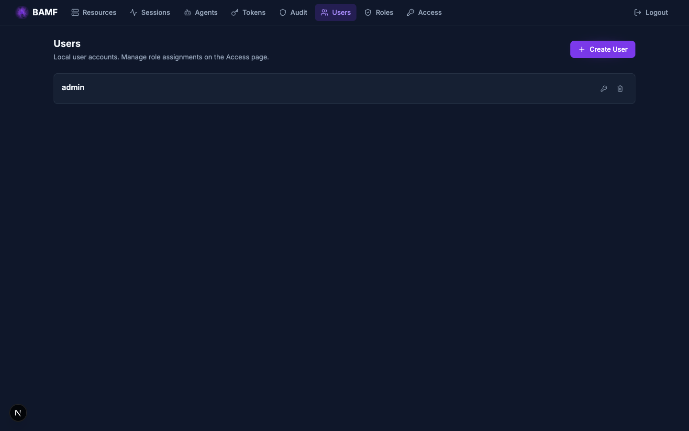

# User Management

BAMF has two types of users: local users (managed in the database) and SSO users
(identity comes from the IdP).

## Local Users

Local users are created by admins and stored in the `users` table with bcrypt
password hashes.

### Create a User

Via the web UI (**Users** page) or API:

```zsh
curl -X POST https://bamf.example.com/api/v1/users \
  -H "Authorization: Bearer ${TOKEN}" \
  -H "Content-Type: application/json" \
  -d '{"email": "alice@example.com", "password": "secure-password", "is_active": true}'
```

### Update a User

```zsh
# Change password
curl -X PATCH https://bamf.example.com/api/v1/users/alice@example.com \
  -H "Authorization: Bearer ${TOKEN}" \
  -H "Content-Type: application/json" \
  -d '{"password": "new-password"}'

# Disable a user
curl -X PATCH https://bamf.example.com/api/v1/users/alice@example.com \
  -H "Authorization: Bearer ${TOKEN}" \
  -H "Content-Type: application/json" \
  -d '{"is_active": false}'
```

### Delete a User

```zsh
curl -X DELETE https://bamf.example.com/api/v1/users/alice@example.com \
  -H "Authorization: Bearer ${TOKEN}"
```



## SSO Users

SSO users are **not stored in the database**. Their identity comes from the IdP
token at login time. Recent SSO logins are cached in Redis for the admin UX.

This means:
- SSO users appear in the "Recent Users" view after their first login
- Role assignments for SSO users work via `(provider, email)` — no database
  user record needed
- Pre-provisioning is possible: assign roles to an email before the user logs in

## Sessions

### View Active Sessions

The **Sessions** page shows all active sessions:


Admins see all sessions; regular users see only their own.

### Revoke Sessions

```zsh
# Revoke all sessions for a user
curl -X DELETE https://bamf.example.com/api/v1/auth/sessions/user/alice@example.com \
  -H "Authorization: Bearer ${TOKEN}"
```

Revoking sessions takes effect immediately — the Redis session key is deleted,
and the next API request with that session token will fail.

### Session Lifetime

Sessions expire after a configurable duration (default: 12 hours). This is
controlled by the Redis key TTL. To disable a user mid-session, revoke their
sessions.

## Disabling Users

### Local Users

Set `is_active: false` on the user record. This is checked at login time. To
immediately revoke access, also revoke their active sessions.

### SSO Users

BAMF does not store SSO users, so there is no "disable" toggle. To block an
SSO user:

1. Disable them in the IdP (they can no longer authenticate)
2. Revoke their active BAMF sessions (immediate effect)
3. Remove any role assignments for their email

## Role Assignments

See [RBAC Guide](rbac.md) for assigning roles to users.
