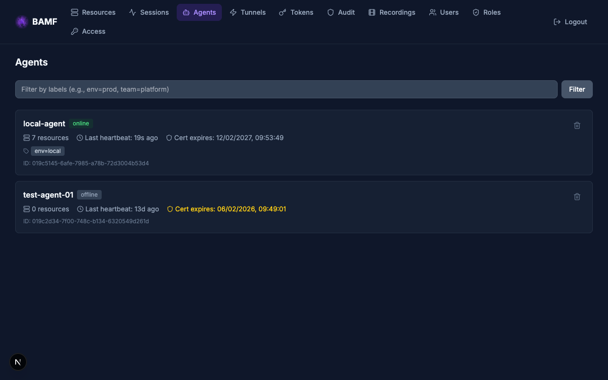

# Agents

BAMF agents are lightweight Go binaries deployed alongside target resources.
They register with the BAMF platform, report resource availability via
heartbeats, and proxy connections on demand.

## Agent Architecture

```
Agent (Go binary)
  ├── SSE connection to API (heartbeats, commands)
  ├── Cert store (filesystem or K8s Secret)
  └── On-demand connections to bridge (mTLS)
        └── Proxy to target resources (SSH, DB, HTTP, K8s)
```

Agents are idle most of the time — they maintain an SSE connection to the API
for receiving tunnel commands, and only connect to bridge pods when a user
requests access to a resource.

## Deployment Options

### Kubernetes (Helm)

Deploy an agent into a cluster to provide access to that cluster's resources:

```zsh
helm install bamf-agent oci://ghcr.io/mattrobinsonsre/bamf \
  --namespace bamf \
  --set agent.enabled=true \
  --set agent.config.name=prod-cluster \
  --set agent.platformUrl=https://bamf.example.com \
  --set agent.joinToken=${TOKEN} \
  --set agent.config.labels.env=prod \
  --set agent.config.labels.team=platform
```

In Kubernetes, certificates are stored in a K8s Secret (not filesystem), so
any pod in the Deployment can access them.

### VM / Bare Metal (systemd)

```zsh
# Download binary
curl -L https://github.com/mattrobinsonsre/bamf/releases/latest/download/bamf-agent-linux-amd64 \
  -o /usr/local/bin/bamf-agent && chmod +x /usr/local/bin/bamf-agent

# Create config
cat > /etc/bamf/agent.yaml << 'EOF'
platform_url: https://bamf.example.com
join_token: YOUR_TOKEN_HERE

resources:
  - name: web-prod-01
    type: ssh
    hostname: web-prod-01.internal
    labels:
      env: prod
      team: platform

  - name: orders-db
    type: postgres
    hostname: localhost
    port: 5432
    labels:
      env: prod
EOF

# Install systemd unit
curl -L https://github.com/mattrobinsonsre/bamf/releases/latest/download/bamf-agent.service \
  -o /etc/systemd/system/bamf-agent.service
systemctl daemon-reload
systemctl enable --now bamf-agent
```

On VMs, certificates are stored on the filesystem at `/var/lib/bamf-agent/`.

## Configuration

### Agent Config File

```yaml
# /etc/bamf/agent.yaml
platform_url: https://bamf.example.com
join_token: ${BAMF_JOIN_TOKEN}        # Only needed for initial registration

resources:
  # SSH resource — agent proxies SSH to this host
  - name: web-prod-01
    type: ssh
    hostname: web-prod-01.internal
    labels:
      env: prod
      team: platform

  # PostgreSQL resource
  - name: orders-db
    type: postgres
    hostname: localhost
    port: 5432
    labels:
      env: prod

  # HTTP resource (web application)
  - name: grafana
    type: http
    tunnel_hostname: grafana
    hostname: grafana.internal.corp
    port: 3000
    labels:
      env: prod

  # Kubernetes resource
  - name: prod-cluster
    type: kubernetes
    hostname: kubernetes.default.svc
    port: 6443
    labels:
      env: prod
```

### Resource Types

| Type | Description | Required Fields |
|------|-------------|-----------------|
| `ssh` | SSH server | `name`, `hostname` |
| `ssh-audit` | SSH server with session recording | `name`, `hostname` |
| `postgres` | PostgreSQL database | `name`, `hostname` |
| `postgres-audit` | PostgreSQL with query audit | `name`, `hostname` |
| `mysql` | MySQL database | `name`, `hostname` |
| `mysql-audit` | MySQL with query audit | `name`, `hostname` |
| `http` | Web application | `name`, `hostname`, `tunnel_hostname` |
| `http-audit` | Web app with request/response audit | `name`, `hostname`, `tunnel_hostname` |
| `kubernetes` | Kubernetes API | `name`, `hostname` |

Port defaults to the standard port for each type if not specified (22 for SSH,
5432 for PostgreSQL, 3306 for MySQL, 80 for HTTP, 6443 for Kubernetes).

### Labels

Labels are key-value pairs attached to resources. They are used in RBAC rules
to grant access:

```yaml
labels:
  env: prod          # Match role rules like allow.labels.env: [prod]
  team: platform     # Match role rules like allow.labels.team: [platform]
  access: everyone   # Special: accessible to all authenticated users
```

The label `access: everyone` is reserved — resources with this label are
accessible to all authenticated users via the implicit `everyone` role.

## Join Token Lifecycle

1. Admin creates a join token (web UI or CLI)
2. Agent is deployed with the token
3. Agent registers with the API, receives a certificate
4. Certificate is stored persistently (filesystem or K8s Secret)
5. Admin can delete the join token — it's no longer needed
6. Agent restarts use the stored certificate, not the token

```zsh
# Create token
bamf tokens create --name prod-agents --ttl 24h --max-uses 10

# Revoke token (after agents have registered)
bamf tokens revoke prod-agents
```

## Heartbeats and Status

Agents send heartbeats every 60 seconds via HTTP POST to the API. After 3 missed
heartbeats (3 minutes), the agent is marked offline and its resources become
unavailable.

The agent reports:
- Online/offline status
- Resource catalog (names, types, labels)
- Connection details for each resource

Resources appear and disappear dynamically based on agent heartbeats — there is
no static resource table in the database.

## Certificate Management

| Certificate | Lifetime | Storage | Renewal |
|-------------|----------|---------|---------|
| Agent identity cert | 1 year (8760 hours, default) | Filesystem or K8s Secret | Auto-renewed via API before expiry |
| BAMF CA public cert | Matches CA lifetime | Same as identity cert | Obtained at registration |

The agent auto-detects its environment:
- In Kubernetes: stores certs in a K8s Secret
- On VM/bare metal: stores certs in `/var/lib/bamf-agent/`

## Monitoring

Check agent status in the web UI on the **Agents** page, or via the API:

```zsh
# List agents (admin only)
curl -H "Authorization: Bearer ${TOKEN}" \
  https://bamf.example.com/api/v1/agents
```



## Troubleshooting

**Agent shows "offline"** — Check that the agent process is running and can
reach the BAMF API. Verify network connectivity and DNS resolution.

**Resources not appearing** — Check the agent config file for syntax errors.
The agent logs resource registration on startup.

**"Join token expired"** — Create a new join token. Once the agent has
registered and received its certificate, the join token is no longer needed.

**Certificate renewal failing** — Check that the agent can reach the API.
Certificate renewal happens automatically before expiry.
